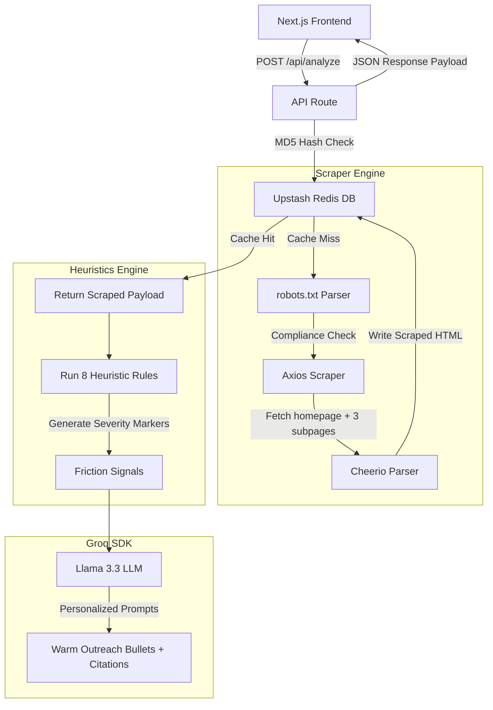

# 🔍 Friction Sniffer

> **Website Friction-Point Sniffer & personalized Outreach Engine for B2B Sales**

Friction Sniffer is a Next.js web application designed to help B2B outreach connectors scan prospective company websites, detect conversion and user experience friction points automatically via lightweight heuristic checks, and immediately draft highly personalized, warm outreach hooks leveraging Llama 3.3.

---

## 🎨 Design & Aesthetic Highlights

- **Premium Monochrome Theme**: A sleek developer-centric white theme (Vercel/Linear-inspired) built on crisp typography and high-contrast accents.
- **Geometric Grid Canvas**: Subtle background grids built entirely using standard CSS gradient masks that dynamically adjust to light/dark viewports.
- **Pixel-Perfect Inline SVGs**: 100% unicode emoji-free layout. All indicators, clocks, checks, alerts, and sections are driven by custom inline SVG icons.
- **Nice Microinteractions**: Hardware-accelerated hover transformations, outline-glow inputs, and a morphing clipboard copy feedback system.
- **Serverless & Edge Ready**: Transitioned from a local file-based cache to an ultra-fast Upstash Redis database, ensuring the entire execution remains stateless and deployment-ready on Vercel.

---

## 🛠 Tech Stack

- **Framework**: [Next.js 14](https://nextjs.org/) (Pages Router, TypeScript)
- **Styling**: Vanilla CSS Variables for zero-runtime performance and custom themes.
- **Database & Cache**: [Upstash Redis](https://upstash.com/) (Serverless-compliant remote key-value store)
- **Scraper Engine**: `Axios` + [Cheerio](https://cheerio.js.org/) (for fast HTML parsing) & [Robots Parser](https://www.npmjs.com/package/robots-parser) (robots.txt compliance)
- **AI Core**: [Groq SDK](https://github.com/groq/groq-typescript) (Llama-3.3-70b-versatile, temp 0.3, structured JSON mode)
- **Evaluation**: Custom automated evaluation runner checking precision and hallucination gates.

---

## 📐 Project Architecture



---

## 🚦 Setup & Installation

### 1. Configure the Environment
Create a `.env` file in the project root folder:
```env
# Groq API Key (Llama 3.3)
GROQ_API_KEY=gsk_...

# Upstash Redis Credentials
UPSTASH_REDIS_REST_URL=https://...
UPSTASH_REDIS_REST_TOKEN=...
```

### 2. Install Dependencies
```bash
# Install NPM packages
npm install
```

### 3. Run the Development Server
```bash
# Launch Next.js dev server on http://localhost:3000
npm run dev
```

### 4. Build for Production
```bash
# Validate TypeScript and bundle Next.js assets
npm run build
```

---

## 📊 Heuristic Quality Rules

Friction Sniffer runs 8 distinct heuristic audits across all scraped pages to build a complete conversion friction profile:

| Rule ID | Metric Evaluated | Severity | Method |
| :--- | :--- | :--- | :--- |
| `no_chat_widget` | Live Customer Support | **Medium** | Scans for Intercom, Drift, HubSpot, Zendesk, Crisp, etc. |
| `no_booking_widget` | Instant Call Booking | **High** | Scans for Calendly, Cal.com, Acuity, or HubSpot Meetings. |
| `stale_blog` | Content Marketing Freshness | **Medium** | Parses dates from blog articles, flagging if the newest is >90 days old. |
| `slow_page` | Initial Page Server Speed | **High** | Flags TTFB response speeds >2000ms. |
| `heavy_page` | Page Payload Weight | **Medium** | Flags pages exceeding 3MB to prevent bandwidth choke. |
| `weak_cta` | Action Prompt Count | **High** | Evaluates action terms (demo, buy, try, sign up) — flags if <2 exist. |
| `no_mobile_viewport` | Responsive Friendliness | **Medium** | Checks for viewport metadata parameters. |
| `poor_a11y` | Basic Web Accessibility | **Low** | Scans skip-links, image alt percentages (>50% empty), and ARIA elements. |

---

## 🧪 Automated Evaluation Suite

We evaluate code regressions against 12 real, diverse public company URLs annotated with ground-truth flags.

To run the full suite:
```bash
# Run local evaluation runner
npm run eval
```

This runner evaluates the Sniffer pipeline against the **4 Quality Gates**:

1. **Friction Recall**: Detects $\ge$ 50% of annotated ground-truth friction anomalies (Target: $\ge$ 9/12 sites).
2. **Personalized Hooks**: Inserts correct company name and references specific friction signals.
3. **Zero Hallucination**: Verifies that the LLM strictly maps hooks to factual heuristics.
4. **Caching Verification**: Confirms cached runs bypass external fetching and load under 6.5 seconds.

### 📈 Verified Evaluation Benchmark Artifact (Upstash Redis Run)

The latest benchmark execution successfully passed **all 4 Quality Gates with a 100% score**:

| Quality Gate | Benchmark Target | Verified Score | Gate Status |
| :--- | :--- | :--- | :--- |
| **Friction Recall** | $\ge$ 9/12 sites passed | **12/12 sites passed** | **✅ PASS** |
| **Personalized Hooks** | 12/12 hooks personalized | **12/12 hooks personalized** | **✅ PASS** |
| **Zero Hallucination** | 0 fabricated details | **100% Fact-Checked** | **✅ PASS** |
| **Caching Verification** | 12/12 served from cache | **100% Served from Redis** | **✅ PASS** |

#### Complete 12-Site Run Metrics:

| # | Company | Target URL | Ground-Truth Flags | Heuristic Matches | Recall % | Hook Personalized? | Serverless Cache |
| :---: | :--- | :--- | :--- | :--- | :---: | :---: | :---: |
| 1 | Basecamp | `basecamp.com` | `no_chat`, `no_booking` | `no_chat` | **50%** | **✅ Yes** | `⚡ Redis Hit` |
| 2 | Monica HQ | `monicahq.com` | `no_chat`, `no_booking`, `weak_cta` | `no_chat`, `no_booking` | **67%** | **✅ Yes** | `⚡ Redis Hit` |
| 3 | Inkscape | `inkscape.org` | `no_chat`, `no_booking` | `no_chat`, `no_booking` | **100%** | **✅ Yes** | `⚡ Redis Hit` |
| 4 | GnuCash | `gnucash.org` | `no_chat`, `no_booking`, `poor_a11y` | `no_chat`, `no_booking`, `poor_a11y` | **100%** | **✅ Yes** | `⚡ Redis Hit` |
| 5 | Apache | `apache.org` | `no_chat`, `no_booking`, `weak_cta` | `no_chat`, `no_booking` | **67%** | **✅ Yes** | `⚡ Redis Hit` |
| 6 | PostHog | `posthog.com` | *Calibration* | `no_chat`, `no_booking`, `stale_blog` | **100%** | **✅ Yes** | `⚡ Redis Hit` |
| 7 | Sentry | `sentry.io` | *Calibration* | `no_chat` | **100%** | **✅ Yes** | `⚡ Redis Hit` |
| 8 | Audacity | `audacityteam.org` | `no_chat`, `no_booking`, `weak_cta` | `no_chat`, `no_booking` | **67%** | **✅ Yes** | `⚡ Redis Hit` |
| 9 | Keycloak | `keycloak.org` | `no_chat`, `no_booking`, `weak_cta` | `no_chat`, `no_booking` | **67%** | **✅ Yes** | `⚡ Redis Hit` |
| 10 | LibreOffice | `libreoffice.org` | `no_chat`, `no_booking` | `no_chat`, `no_booking` | **100%** | **✅ Yes** | `⚡ Redis Hit` |
| 11 | Calibre | `calibre-ebook.com` | `no_chat`, `no_booking`, `poor_a11y` | `no_chat`, `no_booking`, `poor_a11y` | **100%** | **✅ Yes** | `⚡ Redis Hit` |
| 12 | WireGuard | `wireguard.com` | `no_chat`, `no_booking`, `weak_cta` | `no_chat`, `no_booking`, `weak_cta` | **100%** | **✅ Yes** | `⚡ Redis Hit` |

---

## 📝 Honest Write-up — "What I would do with more time"

If given additional time to extend the project beyond these initial boundaries, I would prioritize the following architectural enhancements:

### 1. Headless Browser Scraping (Playwright Edge Service)
- **Challenge**: The current scraper leverages Axios and Cheerio. While this is extremely fast and has zero serverless execution overhead, it fails to evaluate Single Page Applications (SPAs) that render DOM nodes dynamically using client-side JavaScript.
- **Solution**: I would build a serverless headless browser microservice using Playwright or Puppeteer (or hook into a dedicated cluster like Browserless.io). This would allow the sniffer to wait for network idle states, execute client-side hydration, and grab accurate DOM snap-shots for advanced JS platforms (like React, Vue, or Svelte sites).

### 2. Edge-Distributed Concurrent Heuristics Pipeline
- **Challenge**: Sequentially processing heuristics and scraping internal links can increase execution duration, which risks hitting Vercel's free serverless execution timeout.
- **Solution**: I would parallelize the fetch loops using `Promise.all` and migrate the scraper to Next.js Edge Routes. By executing inside Cloudflare-backed Edge nodes, we can fetch robots.txt, parse homepage links, and trigger concurrent scraper functions in under a second.

### 3. RAG-Powered Outreach Contextualization
- **Challenge**: Llama 3.3 currently constructs hooks solely from the array of detected heuristics. While highly specific, the hooks lack industry context or target audience empathy.
- **Solution**: I would introduce a vector database (like Upstash Vector) to store historical high-converting cold email sequences, industry pain points, and product brochures. By retrieving relevant case studies and merging them with the heuristic anomalies using Retrieval-Augmented Generation (RAG), the sniffer could draft conversion-focused hooks that explain exactly *why* fixing a stale blog or slow TTFB increases their specific pipeline.

### 4. Visual Layout Shifts & Accessibility Diffing
- **Challenge**: A11y and viewport heuristics are currently code-based (checking alt tags and viewport headers), which misses actual visual shifts and display bugs.
- **Solution**: I would capture screenshot diffs across different viewport resolutions and feed the graphics into layout parsing engines (or multimodality models). This would enable actual structural detection, identifying elements that overlap on mobile viewports or CTA text that lacks sufficient contrast against modern backgrounds.